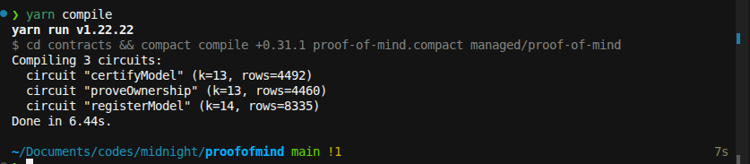
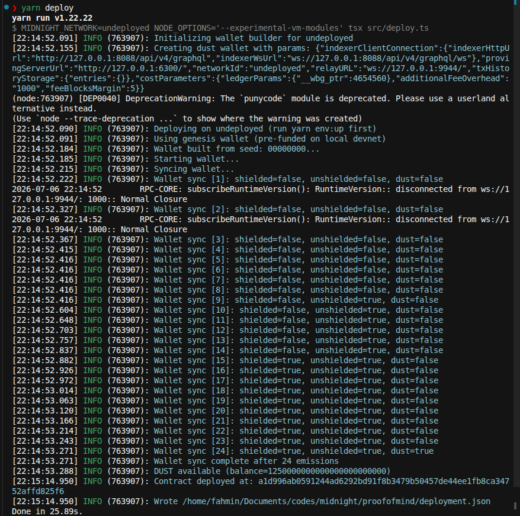

# Proof of Mind

ZK-verified AI benchmarking on [Midnight Network](https://midnight.network). Model providers register benchmark claims using private witnesses — model fingerprints and provider secrets never touch the ledger. Only cryptographic commitments and disclosed metrics appear on-chain.

## Product idea

When an AI company claims "94% accuracy on medical diagnosis," buyers must trust them blindly. **Proof of Mind** is a privacy-first benchmarking registry: providers commit to a model fingerprint locally, disclose only a hash and accuracy metric on-chain, and prove ownership via ZK circuits.

## Prerequisites

- **Node.js 22+**
- **Docker** (local devnet + proof server)
- **Compact compiler** 0.31.1 (`compact update 0.31.1`)
- **Yarn 1.22**

### Install Compact

```bash
curl --proto '=https' --tlsv1.2 -sSf \
  https://github.com/midnightntwrk/compact/releases/latest/download/compact-installer.sh | sh
source $HOME/.local/bin/env
compact update 0.31.1
compact compile --version
```

## Setup

```bash
yarn setup:l1
```

Or manually (one command per line, no trailing comments):

```bash
yarn install
yarn compile
yarn env:up
yarn test:local
```

If port 6300 is in use, `yarn env:up` starts node + indexer only; keep a proof server on `http://127.0.0.1:6300`.

## Deploy (undeployed)

```bash
yarn env:up
yarn deploy
```

Uses the pre-funded genesis wallet on local devnet. Address is written to [`deployment.json`](deployment.json).

## Public state vs private witness

| Data | Visibility | Stored where |
|------|------------|--------------|
| Model fingerprint (weights hash) | **Private** | Witness + local private state |
| Provider secret | **Private** | Witness only |
| Model commitment `persistentHash(fingerprint)` | **Public** | On-chain `models` map key |
| Provider commitment | **Public** | `ModelEntry.providerCommitment` |
| Accuracy (basis points) | **Public** | `ModelEntry.accuracyBps` |

**What an observer learns:** a provider registered a commitment at a disclosed accuracy. They **cannot** recover model weights, raw fingerprints, or test prompts from chain data alone.

## Circuits

- `registerModel(accuracyBps)` — hash witnesses, disclose commitments + metric
- `proveOwnership(modelCommitment)` — provider ZK auth
- `certifyModel(modelCommitment, minAccuracyBps)` — threshold credential

## Project structure

```
contracts/
  proof-of-mind.compact
  witnesses.ts
  managed/proof-of-mind/
src/
  test/proof-of-mind.test.ts
  deploy.ts
```

## Screenshots

### `yarn compile`



### `yarn deploy`



See [`SUBMISSION.md`](SUBMISSION.md) for the full Level 1 checklist.

## Further reading

- [`ROADMAP.md`](ROADMAP.md) — Level 2+ frontend, preprod, CI, post-hackathon plans
- [`hackathon-stages.md`](hackathon-stages.md) — official hackathon stage requirements

## License

MIT
