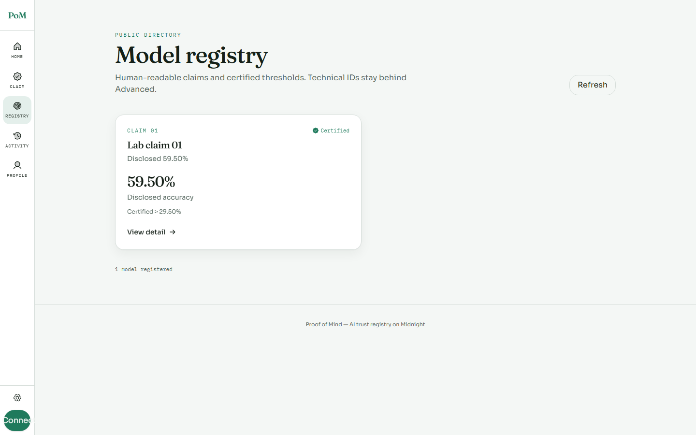
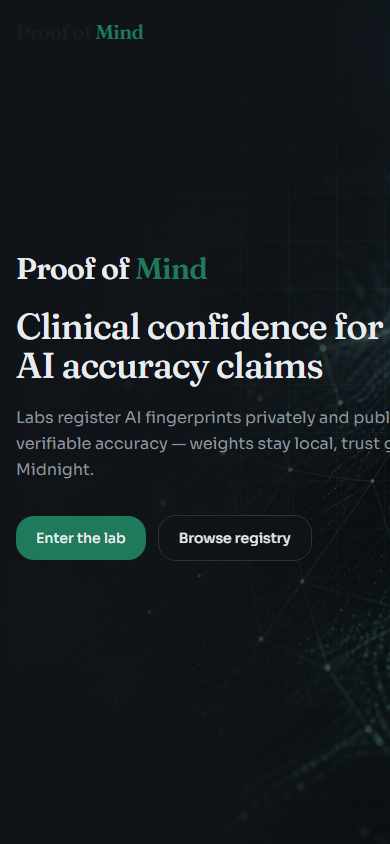

# Proof of Mind

ZK-verified AI benchmarking on [Midnight Network](https://midnight.network). Model providers register benchmark claims with private witnesses — fingerprints and secrets never touch the ledger. Only commitments and disclosed metrics appear on-chain.

**Live dApp (Preview):** [https://proof-of-mind.vercel.app](https://proof-of-mind.vercel.app)  
**Live demo video:** [Watch on YouTube](https://youtu.be/jwOxn-CEkBo)

| Level | Codename | Status |
|-------|----------|--------|
| L1 | New Moon | Complete |
| L2 | Waxing Crescent | Complete |
| **L3** | **First Quarter** | **Complete** |

## Screenshots

### Landing (desktop)


### Model registry (desktop)



### Landing (mobile)



## Preview deployment

| Field | Value |
|-------|--------|
| Network | `preview` |
| Frontend | [proof-of-mind.vercel.app](https://proof-of-mind.vercel.app) |
| Demo video | [YouTube](https://youtu.be/jwOxn-CEkBo) |
| Contract address | `c27a3d1428ea26c5c1014bc05d19c9e5764fd9467f0157f5aedafef76d699bd1` |
| Indexer | `https://indexer.preview.midnight.network/api/v4/graphql` |
| ZK assets | `/zk/proof-of-mind` |

Config source: [`web/src/config.ts`](web/src/config.ts). Connect **Lace** or **1AM** on **preview**.

## Test output (4 tests passing)

```text
fahmin@Defiance15:~/midnight/proof-of-mind$ yarn test:local
yarn run v1.22.22
$ MIDNIGHT_NETWORK=undeployed yarn test
$ NODE_OPTIONS='--experimental-vm-modules' vitest run

 RUN  v3.2.4 /home/fahmin/midnight/proof-of-mind

 ✓ src/test/proof-of-mind.test.ts (4)
   ✓ Proof of Mind Contract (4)
     ✓ deploys the contract
     ✓ registers a model with disclosed commitments only
     ✓ proves provider ownership without revealing secrets
     ✓ certifies model meets a minimum accuracy threshold

 Test Files  1 passed (1)
      Tests  4 passed (4)
   Start at  03:13:36
   Duration  51.08s

Done in 51.93s.
```

Full dump: [`docs/screenshots/test-passing.txt`](docs/screenshots/test-passing.txt).

CI: [`.github/workflows/ci.yml`](.github/workflows/ci.yml) — compile + `yarn test:local` on push.

## Privacy claim

| Data | Visibility | Where |
|------|------------|-------|
| Model fingerprint | **Private** | Witness + local private state |
| Provider secret | **Private** | Witness only |
| Model commitment | **Public** | On-chain `models` map key |
| Provider commitment | **Public** | `ModelEntry.providerCommitment` |
| Accuracy (bps) | **Public** | `ModelEntry.accuracyBps` |
| Certification threshold | **Public** | `certifications` map |

**What an observer learns:** a provider registered a commitment at a disclosed accuracy (and optional certified floor). They cannot recover weights, fingerprints, or test prompts from chain data alone.

## Circuits

| Circuit | Purpose |
|---------|---------|
| `registerModel(accuracyBps)` | Commit fingerprint; disclose accuracy |
| `proveOwnership(modelCommitment)` | Provider ZK auth |
| `certifyModel(modelCommitment, minAccuracyBps)` | Prove disclosed accuracy ≥ threshold |

## Quick start

```bash
nvm use 22
yarn install
yarn compile
yarn env:up
yarn test:local
yarn sync:zk
yarn web:dev          # http://127.0.0.1:3010
```

| Script | Purpose |
|--------|---------|
| `yarn test:local` | Integration tests on undeployed |
| `yarn deploy:preview` | Deploy contract to preview |
| `yarn web:build` | Production Vite build (`web/` → Vercel root) |
| `yarn sync:zk` | Copy managed ZK assets into `web/public` |

## Project structure

```
contracts/   Compact + managed ZK artifacts
api/         Shared contract helpers
src/         Wallet, deploy, vitest, CLI
web/         React 19 + Vite dApp (Vercel root directory)
docs/        Screenshots + Level 3 evidence
```

## Toolchain

| Component | Version |
|-----------|---------|
| Node.js | 22+ |
| Compact | 0.31.1 |
| compact-runtime | 0.16.0 |
| compact-js | 2.5.1 |
| midnight-js | 4.1.1 |
| ledger-v8 | 8.1.0 |

## License

MIT

## Idea (level-pack section)

ZK-verified AI benchmarking on [Midnight Network](https://midnight.network). Model providers register benchmark claims with private witnesses — fingerprints and secrets never touch the ledger. Only commitments and disclosed metrics appear on-chain.

**Live dApp (Preview):** [https://proof-of-mind.vercel.app](https://proof-of-mind.vercel.app)  
**Live demo video:** [Watch on YouTube](https://youtu.be/jwOxn-CEkBo)

| Level | Codename | Status |
|-------|----------|--------|
| L1 | New Moon | Complete |
| L2 | Waxing Crescent | Complete |
| **L3** | **First Quarter** | **Complete** |

## Setup (level-pack section)

```bash
# 1. install toolchain (compact, docker, node 22, yarn)
# 2. bring up the local midnight stack
node .claude/skills/midnight-level-pack/scripts/midnight-up.mjs --project .
# 3. compile the contract
# 4. deploy
yarn deploy:undeployed
# 5. run the web
yarn web:dev
# 6. audit
node .claude/skills/midnight-level-pack/scripts/midnight-audit.mjs --project . --target-level 3
```

## Privacy Model (level-pack section)

The contract's public ledger carries only what the system needs to make itself auditable: aggregate state, epoch counters, public roots, and any commitment the contract chose to disclose. The private witness and the local private state hold everything else — identity, payloads, sealed bids, individual positions. Selective disclosure via `disclose()` is the boundary between the two.

| observer can see | observer cannot see |
|------------------|---------------------|
| aggregate state, epoch counters, public roots, and the disclosed subset chosen by the contract | identity, payloads, sealed bids, individual positions, witness values, and any local private state |
| whether a proof of solvency / participation / threshold was produced for the current epoch | the contents that fed the proof (only the proof itself is public) |
| a count of fills, votes, registrations, or claims | who participated in any single fill, vote, registration, or claim |
| an aggregate eligibility nullifier root | which member satisfied the membership check |
| the on-chain clearing flag of an auction or liquidation | the bid vector and the winning bid until the contract chooses to disclose them |


## Architecture (level-pack section)

1. **Compact contract** — circuits and ledger.
2. **Node-side API** — providers, wallet, deploy, CLI, tests.
3. **Browser shell** — multi-page app, Lace wallet, debug drawer.

## Links

- Live demo: https://proof-of-mind-midnight.vercel.app _(placeholder)_
- X profile: https://x.com/proof-of-mind-midnight _(placeholder — see docs/x-profile.md)_
- users.md / feedback.md: PLACEHOLDER opt-out per session instructions
