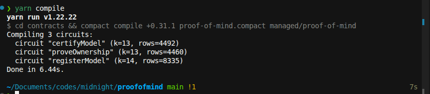
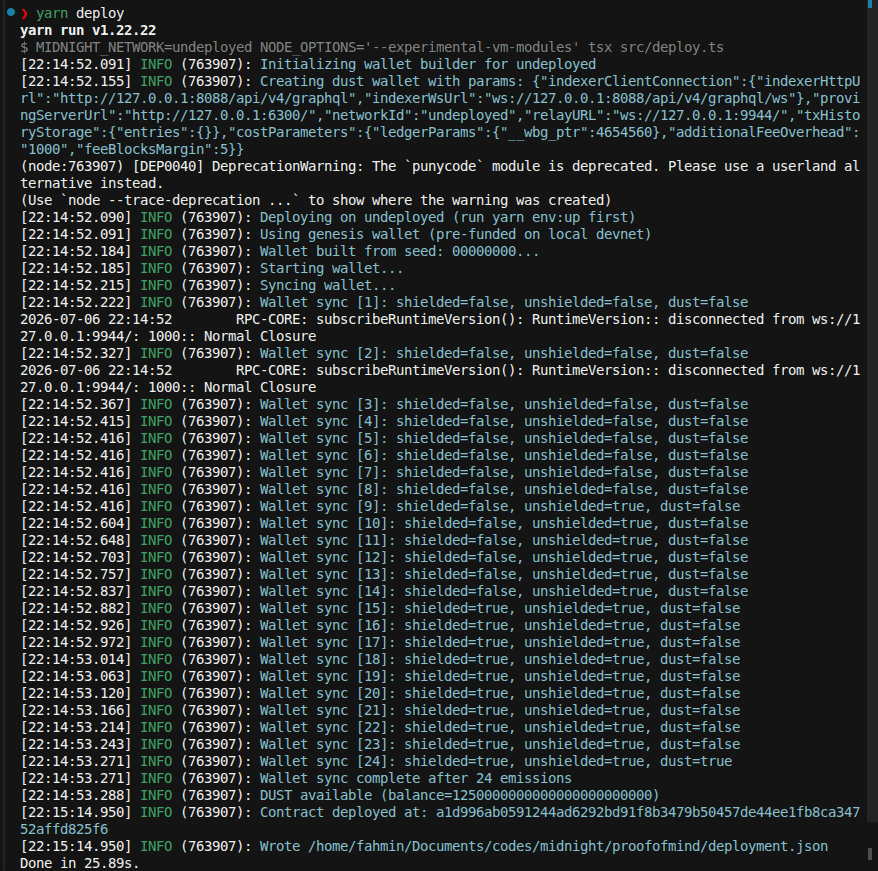

# Proof of Mind

ZK-verified AI benchmarking on [Midnight Network](https://midnight.network). Model providers register benchmark claims using private witnesses. Model fingerprints and provider secrets never touch the ledger. Only cryptographic commitments and disclosed metrics appear on-chain.

## Product idea

When an AI company claims "94% accuracy on medical diagnosis," buyers must trust them blindly. **Proof of Mind** is a privacy-first benchmarking registry: providers commit to a model fingerprint locally, disclose only a hash and accuracy metric on-chain, and prove ownership via ZK circuits.

## Prerequisites

- **Node.js 22+** (`nvm use 22`)
- **Docker** (local devnet + proof server)
- **Compact compiler** 0.31.1 (`compact update 0.31.1`)
- **Yarn 1.22**
- **Lace** or **1AM** wallet extension (for the web UI, network set to undeployed)

### Install Compact

```bash
curl --proto '=https' --tlsv1.2 -sSf \
  https://github.com/midnightntwrk/compact/releases/latest/download/compact-installer.sh | sh
source $HOME/.local/bin/env
compact update 0.31.1
compact compile --version
```

## Setup

```bash
yarn setup:l1
```

Or manually:

```bash
yarn install
yarn compile
yarn env:up
yarn test:local
```

If port 6300 is in use, `yarn env:up` starts node + indexer only; keep a proof server on `http://127.0.0.1:6300`.

## Deploy (undeployed / local only)

```bash
yarn env:up
yarn deploy:undeployed
```

Uses the pre-funded genesis wallet on local devnet. Address is written to [`deployment.json`](deployment.json).

Current undeployed address:

`47d43e9968561ec970c53aa1063cf65a68bad2be995369e4a5969aee06644dc3`

## Frontend (Level 2)

Multi-page React app under `web/`:

| Route | Purpose |
|-------|---------|
| `/` | Storyline landing (fingerprint registry narrative) |
| `/app` | Wallet connect/disconnect, deploy/join, `registerModel` / `proveOwnership` |
| `/registry` | Public indexer registry + privacy split demo + `certifyModel` |

```bash
nvm use 22
yarn sync:zk
yarn web:dev
```

Open http://localhost:3000. Connect **Lace** or **1AM** on **undeployed**, then deploy or paste the address from `deployment.json`.

Wallet detection uses `window.midnight` (prefers `mnLace`, then `1AM`, then any connectable injector). No wallet UUID is hardcoded.

### Circuits wired in the UI

- `registerModel(accuracyBps)`
- `proveOwnership(modelCommitment)`
- `certifyModel(modelCommitment, minAccuracyBps)`

## Public state vs private witness

| Data | Visibility | Stored where |
|------|------------|--------------|
| Model fingerprint (weights hash) | **Private** | Witness + local private state |
| Provider secret | **Private** | Witness only |
| Model commitment `persistentHash(fingerprint)` | **Public** | On-chain `models` map key |
| Provider commitment | **Public** | `ModelEntry.providerCommitment` |
| Accuracy (basis points) | **Public** | `ModelEntry.accuracyBps` |

**What an observer learns:** a provider registered a commitment at a disclosed accuracy. They **cannot** recover model weights, raw fingerprints, or test prompts from chain data alone.

## Project structure

```
contracts/          # Compact + managed ZK artifacts
src/                # Headless wallet, deploy, vitest
web/                # React 19 + Vite multi-page UI
scripts/sync-zk-assets.mjs
deployment.json
```

## Screenshots

### `yarn compile`



### `yarn deploy`



See [`SUBMISSION.md`](SUBMISSION.md) for the Level 1 checklist and [`ROADMAP.md`](ROADMAP.md) for later stages.

## License

MIT
